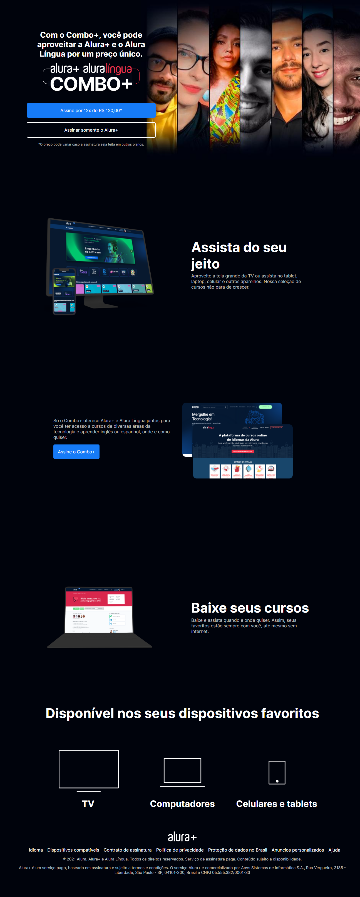

## Devenvolvimento Web em HTML / CSS:

Bem-vindo ao Alura+! 

Projeto desenvolvido como treino do curso HTML E CSS da Alura.

Desenvolvimento web para visualização em desktop.

## Layout desenvolvido pela Alura

## Conheça o resultado clicando no link
https://polysaantana.github.io/aluraplus_tarefa/

  

### Ferramentas utilizadas: 

* Figma

* Vscode

 

### Tecnologias:

* HTML

* CSS

### Autora:
<table>
  <tbody>
    <tr>
	    <td align="center" valign="top">  <a href="https://github.com/polysaantana"> 
